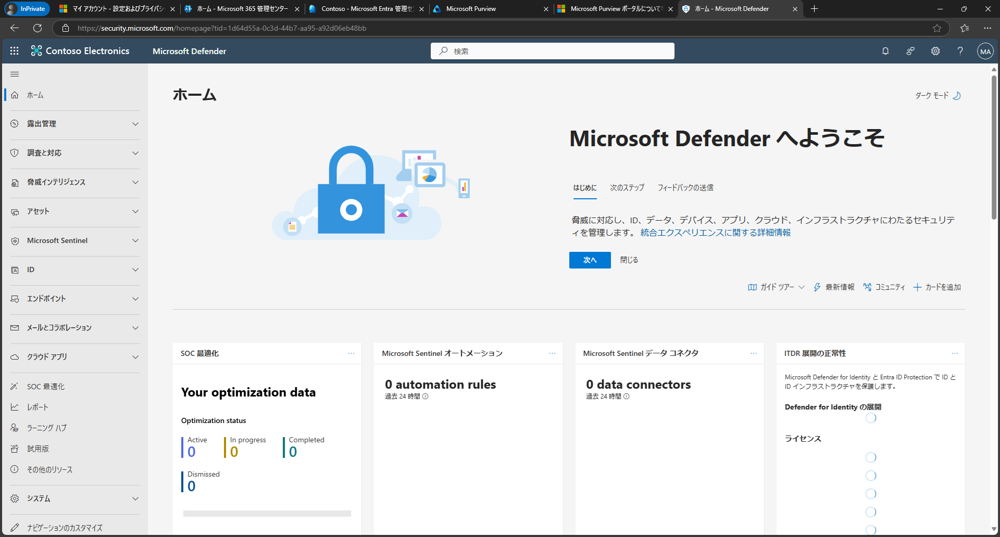
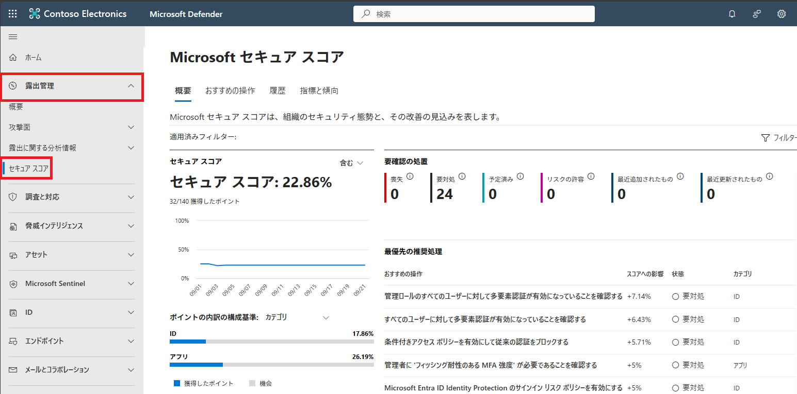
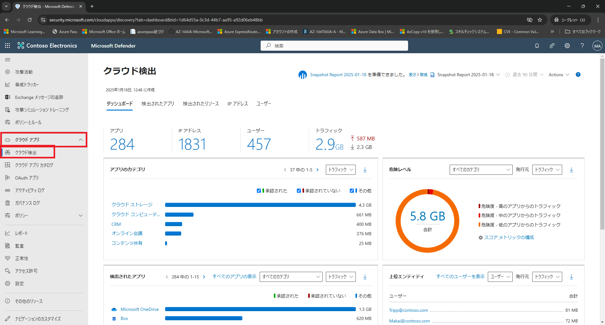

# ラボ02：Microsof  Defenderを探索する

#### 推定時間: 10 分

> 注：タスク1以降は、どのタスクから実施してもOKです。

### タスク 1 - Microsoft Defender ポータルにアクセスする

1. https://security.microsoft.com/ へアクセスし、以下のアカウントでサインインします。

   > 注：ハイパーリンクを開く際は、リンクを右クリックし[新しいタブで開く]等で開いてください。
   >
   > 注：XXXXはご自身のアカウント番号を入力してください。
   >
   > 注：[アカウントの保護にご協力ください]と表示された場合は[今はしない]を選択してください

   | 項目       | 値                                                           |
   | ---------- | ------------------------------------------------------------ |
   | ユーザーID | `admin@XXXXXXXXXXX.onmicrosoft.com` @マーク以降のXXXXXXXXXは各自異なります。 |
   | パスワード | Skillableで取得したパスワード                                |

   

2. [Microsoft Defender ポータル]が表示されます。

   

   

### タスク 2 - セキュアスコアを表示する

3. 左側のナビゲーション メニューの [露出管理] ⇒ [セキュアスコア] の順でクリックします。

   > [解説]
   >
   > **Microsoft Secure Score** は、組織のセキュリティ体制を数値化して評価する指標であり、**Microsoft Defender ポータル**から直接確認・管理できます。このスコアは、組織がどれだけセキュリティのベストプラクティスに従っているかを示すもので、推奨されるアクションを実施することでスコアが上昇し、全体的なセキュリティ体制の強化に繋がります。
   >
   > https://learn.microsoft.com/ja-jp/defender-xdr/microsoft-secure-score
   >
   > 注：ハイパーリンクを開く際は、リンクを右クリックし[新しいタブで開く]等で開いてください。

   

4. [Microsoft セキュア スコア]ページが表示されます。全体を一通り確認します。

   

### タスク 3 - クラウドアプリを表示する

> [解説]
>
> **Microsoft Defender for Cloud Apps**（旧称: Microsoft Cloud App Security）は、組織が使用する **クラウドアプリケーション** のセキュリティと可視性を強化するための **クラウドアクセスセキュリティブローカー（CASB: Cloud Access Security Broker）** ソリューションです。このサービスは、企業がクラウドサービスの利用状況を監視し、不正アクセスやデータ漏洩を防ぐための包括的なツールを提供します。
>
> https://learn.microsoft.com/ja-jp/defender-cloud-apps/what-is-defender-for-cloud-apps
>
> 注：ハイパーリンクを開く際は、リンクを右クリックし[新しいタブで開く]等で開いてください。

1. 左側のナビゲーション メニューの [クラウドアプリ]⇒[クラウド検出]の順でクリックします。

   

2. 初めてのアクセスの場合時間がかかることがあります(※)が、[クラウド検出]ページが表示されます。全体を一通り確認します。
   (※) 場合によっては、Microsoft 365 Defender ポータル (https://security.microsoft.com) をもう１つ、ブラウザーの別のタブで開いて、こちらを待っている間に先のタスクを進めても構いません。

**Lab02は以上です。お疲れ様でした。**
