# ラボ1-3：Microsoft Purview を探索する

#### 推定時間: 20 分

> 注意：タスク1以降は、どのタスクから実施してもOKです。

### タスク 1 - Microsoft  Purview ポータルへアクセスする

1. https://purview.microsoft.com/ へアクセスし、以下のアカウントでサインインします。

   > 注：ハイパーリンクを開く際は、リンクを右クリックし[新しいタブで開く]等で開いてください。
   >
   > 注：XXXXはご自身のアカウント番号を入力してください。
   >
   > 注：[アカウントの保護にご協力ください]と表示された場合は[今はしない]を選択してください

   | 項目       | 値                                                           |
   | ---------- | ------------------------------------------------------------ |
   | ユーザーID | `admin@XXXXXXXXXXX.onmicrosoft.com` @マーク以降のXXXXXXXXXは各自異なります。 |
   | パスワード | Skillableで取得したパスワード                                |

   

1. [Microsoft Purview ポータル]が表示されます。

   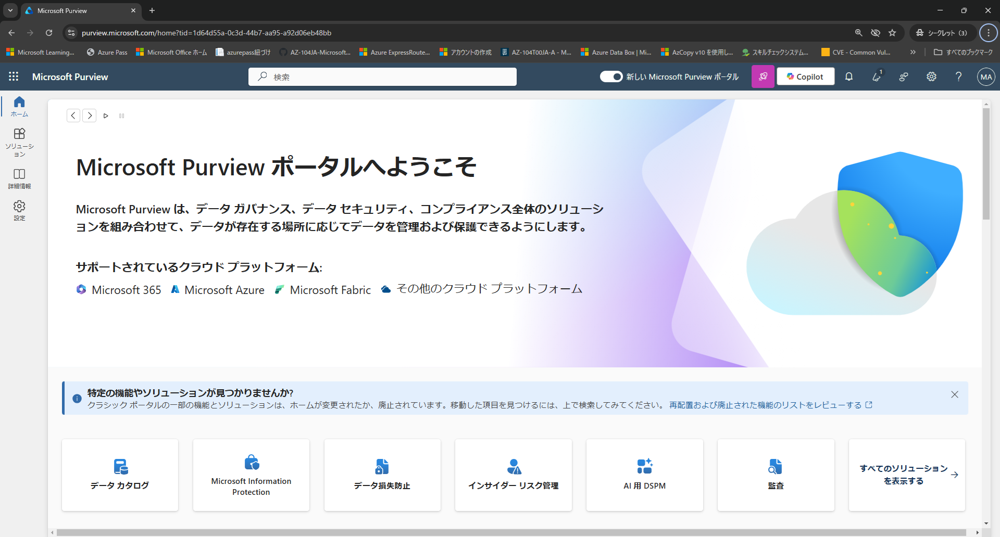

### タスク 2 - コンプライアンス マネージャーを確認する

> [解説]
>
> Microsoft Purview コンプライアンスマネージャーは、組織のコンプライアンス体制を効率的に管理・監視するためのツールで、Microsoft 365 環境全体のリスク管理や規制遵守状況の評価を支援します。このツールは、GDPR、ISO 27001、HIPAA などの国際的な規制や業界基準に基づいて、コンプライアンスのギャップを特定し、具体的な改善策を提案します。
>
> https://learn.microsoft.com/ja-jp/purview/compliance-manager-setup
>
> 注：ハイパーリンクを開く際は、リンクを右クリックし[新しいタブで開く]等で開いてください。

1. 左側のナビゲーション メニューの [ソリューション]をクリックし、[コンプライアンス マネージャー]をクリックします。

   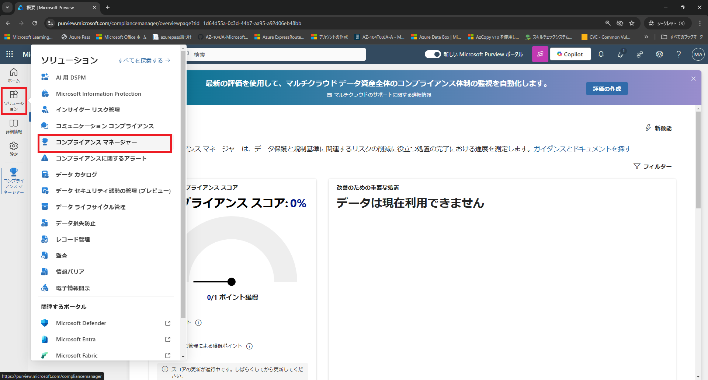

   

2. [コンプライアンス マネージャー]と表示されます。左側のナビゲーション メニューの[改善アクション]をクリックします。

   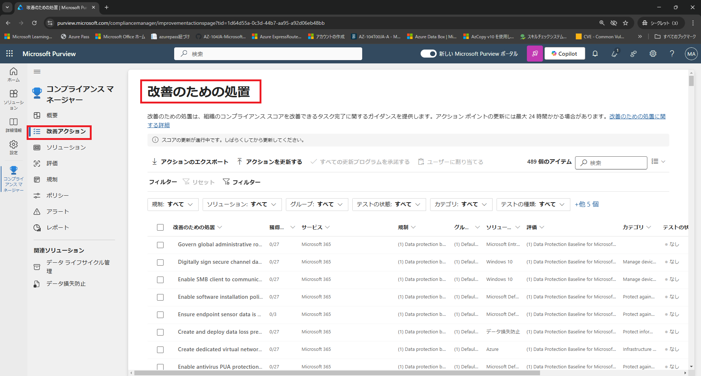

   

3. 改善のための処置が一覧に表示されます。適当な項目をクリックし、詳細を確認します。

### タスク 3 - コミュニケーション コンプライアンスを確認する

> [解説]
>
> コミュニケーションコンプライアンス（Communication Compliance）は、組織内の従業員間のコミュニケーション（メール、チャット、ファイル共有など）を監視し、規制遵守や企業ポリシーに違反する行為を検出・対応するための Microsoft のソリューションです。特に、不適切な発言、ハラスメント、機密情報の漏洩などのリスクをリアルタイムで監視・管理し、企業のガバナンス強化に貢献します。
>
> この機能は、Microsoft Purview コンプライアンス ポータルの一部として提供され、Microsoft Teams、Exchange Online、SharePoint Online、OneDrive for Business など、Microsoft 365 の主要なコミュニケーションツールと連携して動作します。
>
> https://learn.microsoft.com/ja-jp/purview/communication-compliance-solution-overview
>
> 注：ハイパーリンクを開く際は、リンクを右クリックし[新しいタブで開く]等で開いてください。

1. 左側のナビゲーション メニューの [ソリューション]をクリックし、[コミュニケーション コンプライアンス]をクリックします。

   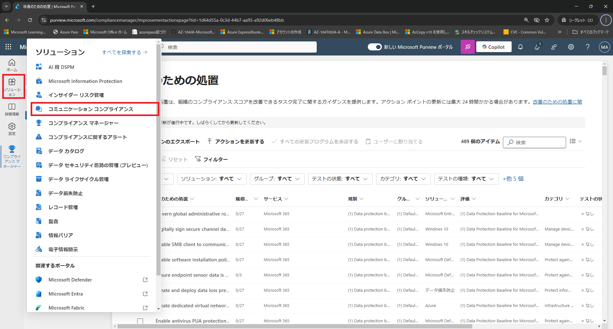

2. [不適切なテキストを含むメッセージを調査する]の項目にある[ポリシーの作成]をクリックします。

   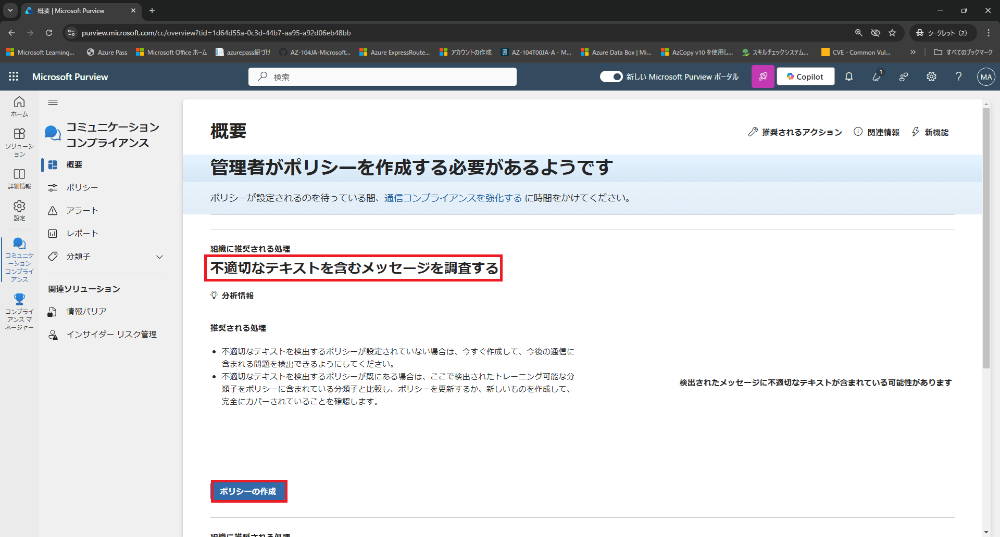

   

3. [不適切なテキストの通信の検出]画面で以下の内容で入力し、[ポリシーの作成]をクリックします。

   | 項目           | 値                |
   | -------------- | ----------------- |
   | ポリシー名     | 不適切なテキスト  |
   | レビュー担当者 | MOD Administrator |

   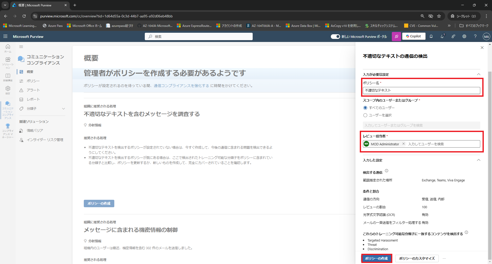

   

4. [ポリシーが作成されました]と表示されたら、[閉じる]をクリックします。

### タスク 4 - データ損失防止を確認する

> [解説]
>
> データ損失防止（Data Loss Prevention: DLP） は、組織内の機密情報や重要データが不正に共有、送信、または漏洩するのを防ぐための技術やポリシーのことを指します。Microsoft 365 では、Microsoft Purview データ損失防止（DLP）機能を使用して、メール、ドキュメント、チャットなどの情報流出をリアルタイムで監視し、制御することができます。
>
> https://learn.microsoft.com/ja-jp/purview/dlp-learn-about-dlp
>
> 注：ハイパーリンクを開く際は、リンクを右クリックし[新しいタブで開く]等で開いてください。

1. 左側のナビゲーション メニューの [ソリューション]をクリックし、[データ損失防止]をクリックします。

   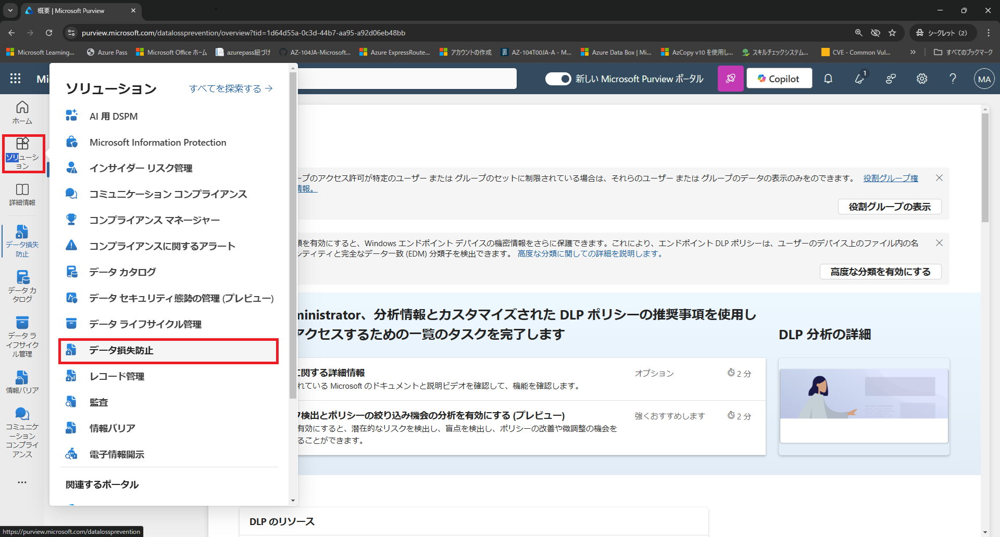

2. 左側のナビゲーション メニューの[ポリシー]をクリックし、[ポリシーの作成]をクリックします。

   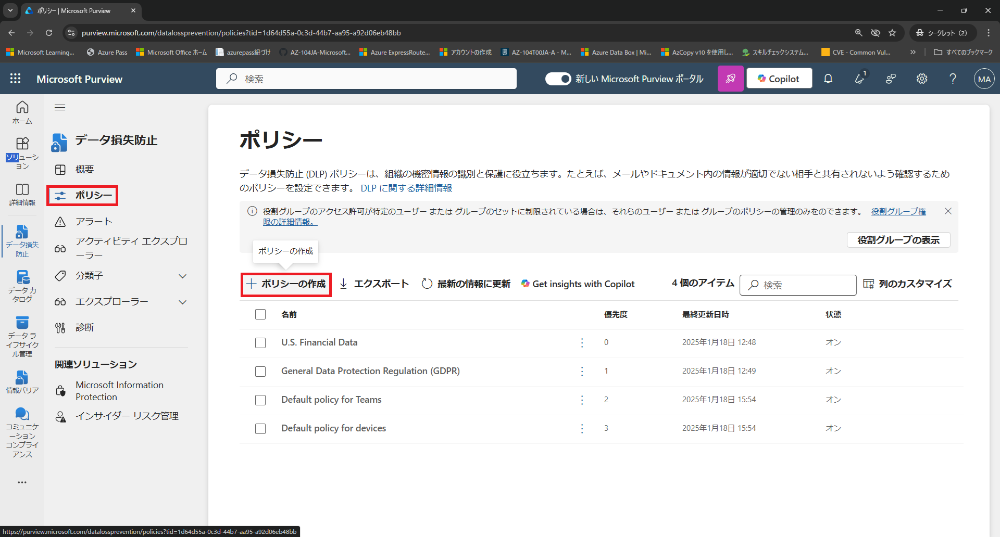

3. [どのような情報を保護しますか?]ページでは、 [エンタープライズ アプリケーションとデバイス] を選択します。

4. [テンプレートの利用またはカスタム ポリシーの作成]では[すべての国または地域]で[日本]を選択します。

   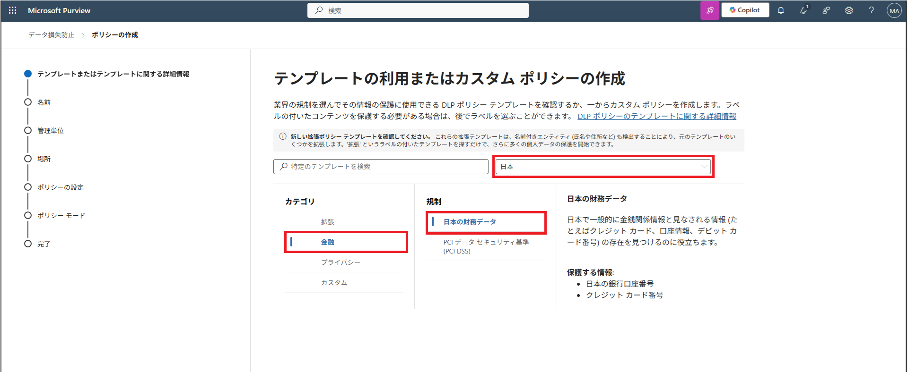

5. [金融]をクリックし、さらに[日本の財務データ]をクリックし、画面下にある[次へ]をクリックします。

6. [DLP ポリシーの名前の設定]は、変更せずに画面下にある[次へ]をクリックします。

7. [管理単位を割り当てる]は、変更せずに画面下にある[次へ]をクリックします。

8. [このポリシーの適用先を選択します]は、変更せずに画面下にある[次へ]をクリックします。

9. [ポリシーの設定の定義]は、変更せずに画面下にある[次へ]をクリックします。

10. [保護対象の情報]は、変更せずに画面下にある[次へ]をクリックします。

11. [保護処理]は、変更せずに画面下にある[次へ]をクリックします。

12. [アクセスと上書きの設定のカスタマイズ]は、変更せずに画面下にある[次へ]をクリックします。

13. [ポリシー モード]は、変更せずに画面下にある[次へ]をクリックします。

14. [確認と完了]では画面下にある[送信]をクリックします。

    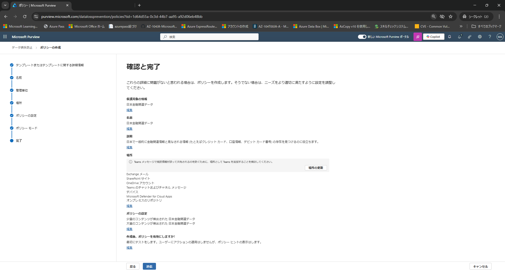

15. [新しいポリシーが作成されました]と表示されます。[完了]をクリックして終了です。

### タスク 5 - 電子情報開示を確認する

> [解説]
>
> 電子情報開示（eDiscovery）は、訴訟や調査に関連する電子データ（Eメール、ドキュメント、チャットなど）を特定・収集・保全・分析・提出するためのプロセスです。Microsoft 365 では、Microsoft Purview eDiscovery 機能を使用して、法的要件やコンプライアンス対応を効率的に実施できます。
>
> https://learn.microsoft.com/ja-jp/purview/ediscovery
>
> 注：ハイパーリンクを開く際は、リンクを右クリックし[新しいタブで開く]等で開いてください。

1. 左側のナビゲーション メニューの [ソリューション]をクリックし、[電子情報開示]をクリックします。

   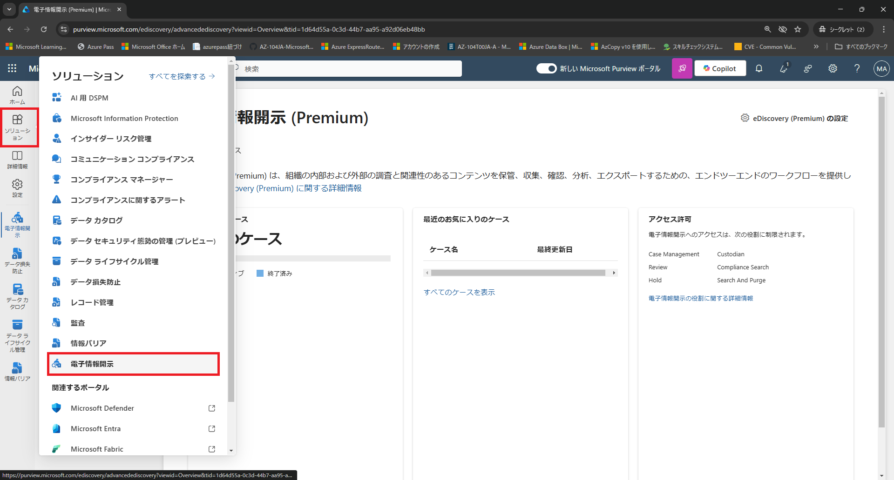

2. [ケース]をクリックし、さらに[ケースを作成]をクリックします。

   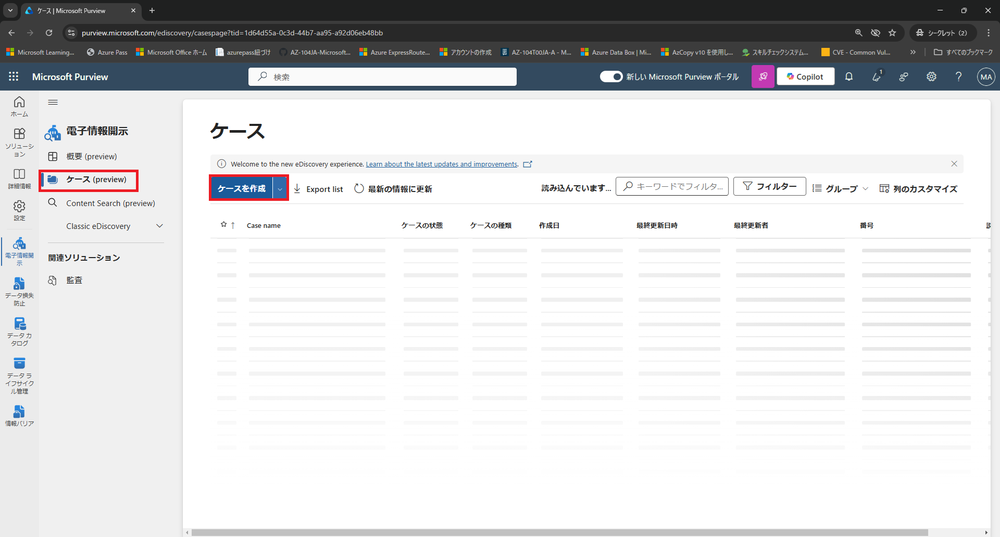

3. [名前]には[2026_内部調査_経理部_不正会計]と入力し、[作成]をクリックします。

   [検索の作成]をクリックし、さらに検索名には[不正会計データ]と入力し、[作成]をクリックします。

4. [不正会計データ]では[テナント全体のソースを追加]をクリックします。

   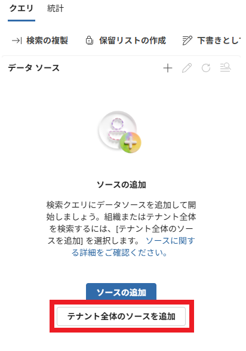

   

6. [保存]をクリックします。

   

7. [不正会計データ]画面で、[条件ビルダー] の [キーワード]に[売上帳]と入力した後、[クエリの実行] を２回クリックします。

   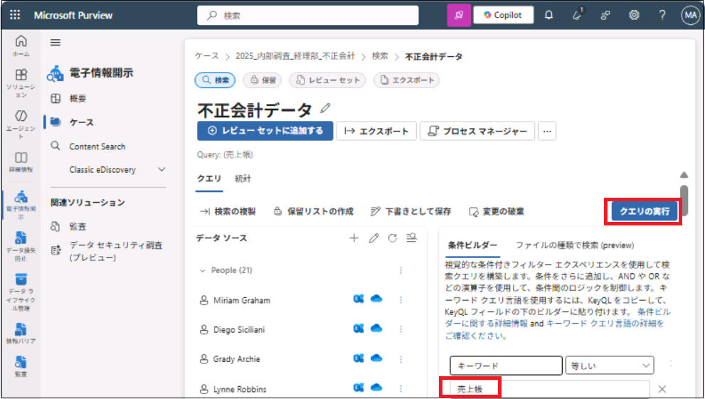

   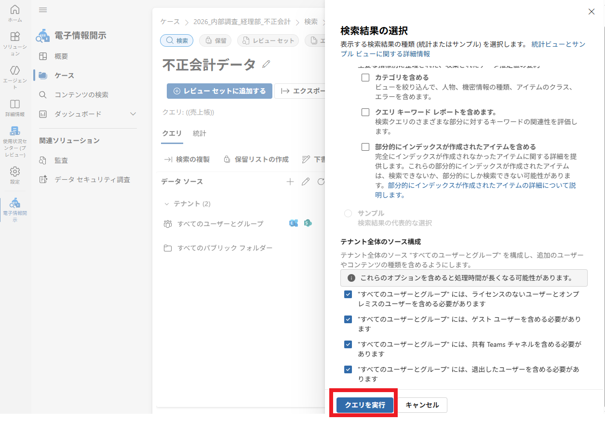

   

   > 注：本来はデータがあれば、検索結果が表示されますが、何もでないので演習はここまでとします。

**Lab1-3は以上です。お疲れ様でした。**
